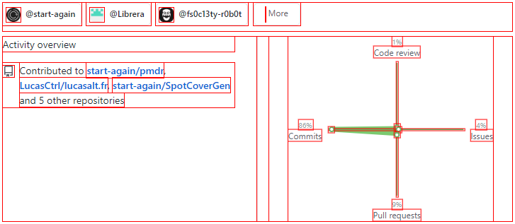
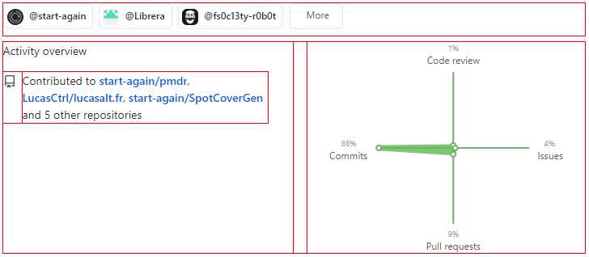

# debug.css
> Outline your components for easy CSS debugging

## 🌈 Different versions

### All elements
All elements will be outlined by a red border

### Only divs
All divs on the page will be outlined by a red border

## 👤 Author

**LucasAlt**
* Website: https://www.lucasalt.fr
* Twitter: [@LucasCtrlAlt](https://twitter.com/LucasCtrlAlt)
* GitHub: [@LucasCtrl](https://github.com/LucasCtrl)

## 🤝 Contributing

1. Fork it (https://github.com/LucasCtrl/debug.css/fork)
2. Create your feature branch (`git checkout -b feature/fooBar`)
3. Commit your changes (`git commit -am 'Add some fooBar'`)
4. Push to the branch (`git push origin feature/fooBar`)
5. Create a new Pull Request

## Show your support

Give a ⭐️ if you like this project!

 

## 📝 License

Copyright © 2020 [LucasCtrl](https://github.com/LucasCtrl/debug.css/blob/master/LICENSE) 
This project is open source and available under the [MIT License](https://github.com/LucasCtrl/debug.css/blob/master/LICENSE)